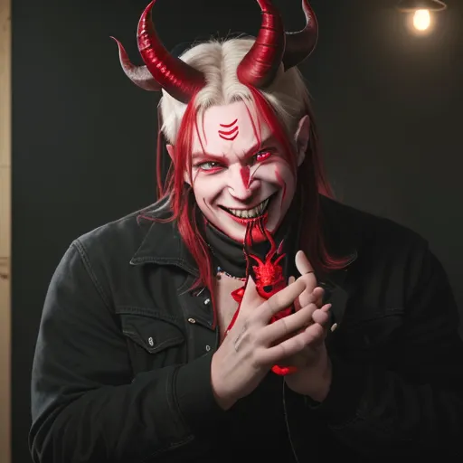

# 🌟 MythicMorph: AI-Powered Creature Generator

Unleash your imagination and bring mythical beings to life! With **MythicMorph**, you can either **transform your own image into a legendary creature** or **craft an entirely new one from scratch** using AI-powered customization.

## ✨ Features
- 🖼️ **Upload & Transform:** Upload your image and customize it into a mythical creature using AI.
- 🎨 **Create from Scratch:** Generate a unique fantasy being based on text descriptions.
- 🔥 **Extensive Customization:** Adjust body type, wings, colors, background, art style, mood, and more.
- 🚀 **Stable Diffusion-Powered:** Uses **DreamShaper-8** for high-quality AI-generated images.
- 🎭 **For Creators & Dreamers:** Designed for anime artists, game designers, and fantasy lovers.

## 🛠️ Tech Stack
- **Stable Diffusion (DreamShaper-8)** – AI model for image generation
- **Diffusers Library** – Runs Stable Diffusion efficiently
- **PyTorch** – Machine learning framework
- **Gradio** – Interactive web UI

## 📸 Screenshots
Coming soon! 🚀

## 🔧 Installation
1. **Clone the repository:**
   ```bash
   git clone https://github.com/Divyansh8791/MythicMorph.git
   cd MythicMorph
   ```
2. **Install dependencies:**
   ```bash
   pip install -r requirements.txt
   ```
3. **Run the application:**
   ```bash
   Provided Colab Notebook , just download , run and enjoy.
   ```

## 🎮 How to Use
1. **Choose a mode:**
   - "Craft Your Own Visual Identity" (Upload & Modify Your Image)
   - "Forge a Myth" (Create a Fantasy Creature from Scratch)
2. **Customize your creature:**
   - Modify appearance, mood, background, and other details.
3. **Generate & Save:**
   - Let AI create your mythical vision!

## 🏆 Use Cases
- **Anime & Game Design:** Create unique characters for stories and games.
- **Art & Illustration:** Generate inspiration for digital paintings and artworks.
- **Casual Fun:** Transform yourself into a mythical creature just for fun!

## 🤝 Contributing
Want to enhance **MythicMorph**? Feel free to fork the repo, submit PRs, or suggest features.

---
🔥 **Unleash your creativity with MythicMorph!** 🔥

## 📸 Input & Output Examples

### Example 1
#### Input:

Prompt : Make me a demon , smile on face , red horns ,  8k , realistic .
#### Output:


### Example 2
#### Input:
##### Prompt : make a fairy mermaid , Add feathers , Big smile , Green Body  ,  8k, highly realistic
#### Output:


